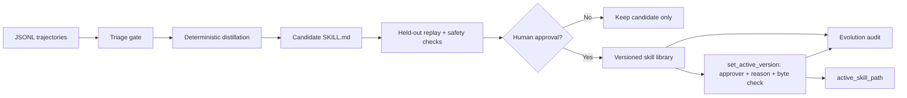

# Self-Evolving Skills 离线示例

[返回首页](../../README.md)

> Harness 层：模型权重保持不变，把成功执行轨迹蒸馏成可审查、可评测、可审批和可回滚的外部 Skill。

## 代码架构图



## 这个示例解决什么问题

s09 已经能保存完整执行轨迹，s10 能从追加式事实中蒸馏长期记忆，s16 能加载和创建 `SKILL.md`，s23 能记录审计证据。本示例把这些思想连成一个部署期学习闭环：

```text
成功轨迹 -> 候选技能 -> 独立评测 -> 人工批准 -> 版本化发布
```

它不是让 Agent 无约束地改写自己的 Prompt 或源码，也不训练模型参数。Agent 的“进化”发生在外部、可读、可 diff、可回滚的 Skill 库中。

## 安全与质量门禁

候选 Skill 必须依次满足：

1. 至少两条同类、成功且步骤一致的训练轨迹；
2. 失败轨迹不能成为 Skill 来源；
3. Skill 只保留通用意图、工具名和 provenance，不复制原始命令或工具输出；
4. 声明的工具必须与实际轨迹一致；
5. 一条未参与蒸馏的 held-out 轨迹必须成功复现相同步骤；
6. 内容必须通过基础危险操作、密钥和提示覆盖扫描；
7. 即使评测通过，没有显式 `approved_by` 也不能进入正式 Skill 库。

字符串扫描只是第一层教学防线，不等于沙盒。真实系统仍需要声明式权限、隔离试跑、网络出口控制和更强的 Skill 安全评测。

## 版本切换与回滚

发布 v2 后发现问题，不需要手改 `manifest.json`。回滚和发布一样，是一次需要显式审批人和原因的发布决策：

```python
store.set_active_version(
    "python-test-validation",
    1,
    approved_by="alice",
    reason="v2 在新仓库上复现失败，先退回 v1",
)
store.active_skill_path("python-test-validation")  # -> skills/python-test-validation/v1/SKILL.md
```

| 规则 | 说明 |
|---|---|
| 只切指针 | 只改 `active_version`，不新建、不改写、不删除任何 `v<N>/SKILL.md`，`history` 保持不变 |
| 同样需要审批 | `approved_by` 和 `reason` 必填，为空直接拒绝，manifest 和审计都不变 |
| 审计为准 | 每次切换写一条 `skill_activated` 审计事件（from、to、审批人、原因）；manifest 只表示当前状态 |
| 激活前核对 | 按 `history` 里的 `candidate_id` 读回 `candidate.json`，重新渲染后与磁盘文件逐字节比较，正文或 frontmatter 被改过都不能生效 |
| 证据缺失即拒绝 | `candidate.json` 缺失或损坏时拒绝激活，不降级成只查 frontmatter |
| 路径可搬迁 | 路径一律由 store 根目录推导，不读 `history` 里记录的旧绝对路径 |
| 幂等 | 切换到当前版本直接返回，不写 manifest，也不写审计 |

`active_skill_path()` 对从未发布的 Skill 返回 `None`；如果生效指针不在 `history` 中、文件被删除或核对不通过，就直接抛 `EvolutionError`，不会返回一个不存在或被改过的路径。

回滚到 v1 后再次批准 v2 的 candidate 只会返回 v2 路径，不会改变生效版本；要重新启用 v2，同样走 `set_active_version()`。

逐字节核对证明的是“发布产物与候选证据一致”，不是密码学签名：如果 `candidate.json` 和 `SKILL.md` 被一起改成一致的样子，这一层核对防不住。和 `promote()` 一样，本示例也不处理多个进程并发写 manifest 的情况。

## 运行

只生成候选并完成评测，在人工审批门前停止：

```bash
python3 examples/self_evolving_skills/code.py
```

模拟用户明确批准，将候选发布为版本化 Skill：

```bash
python3 examples/self_evolving_skills/code.py --approve --approved-by alice
```

指定隔离目录：

```bash
python3 examples/self_evolving_skills/code.py \
  --home /tmp/learn-workbuddy-self-evolution \
  --approve \
  --approved-by alice
```

整个示例不需要 API key，也不会访问网络。

## 产物结构

```text
.tmp/self-evolving-skills/
├── traces/                         # 原始 JSONL 证据
├── candidates/<candidate-id>/
│   ├── candidate.json              # 结构化候选与 provenance
│   ├── SKILL.md                    # 尚未发布的候选
│   └── evaluation.json             # held-out 评测明细
├── skills/python-test-validation/
│   ├── manifest.json               # active_version + 历史版本
│   └── v1/SKILL.md                 # 人工批准后的正式版本
├── evolution-audit.jsonl           # 形成、评测、晋升、切换事件
└── run_manifest.json               # 本轮演示清单
```

重复批准同一个 candidate 是幂等的，不会制造重复版本；由新证据产生的新 candidate 才会进入下一版本。

## 关键数据契约

| 对象 | 作用 |
|---|---|
| `Trajectory` | 带 `trace_id`、任务族、train/validation split、结果和 SHA-256 来源摘要的证据 |
| `SkillCandidate` | 由多条成功轨迹共同支持的候选步骤、工具权限和来源 ID |
| `EvaluationReport` | 每一项门禁的布尔结果，不用一个模糊总分隐藏失败原因 |
| `EvolutionStore` | 隔离保存证据、候选、评测、正式版本和审计事件 |
| `SkillEvolutionPipeline` | triage、distill、evaluate；不拥有跳过人工审批的权限 |

## 设计取舍

- **确定性蒸馏**：教学版要求多条轨迹具有相同的高层步骤，再提取共同流程。以后可以替换为 LLM distiller，但输出契约和门禁不变。
- **失败是教训，不是指令**：失败轨迹会被 triage 拒绝，不能直接发布成可执行 Skill。配套的 [`reflection_memory`](../reflection_memory/) 示例要求重复失败与成功恢复共同支持，再经评测和人工批准后写入独立的非执行 Reflection Memory。
- **评测与训练分离**：held-out trace 不属于 `source_trace_ids`，避免拿训练证据证明自己。
- **候选与发布分离**：通过评测只代表“可以提交审批”，不代表 Agent 有权安装。
- **原始证据不进 Skill**：减少密钥、用户数据、绝对路径和一次性命令被永久固化的风险。

## 验证

```bash
python3 -m pytest -q tests/test_self_evolving_skills.py tests/test_self_evolving_skills_rollback.py
```

测试覆盖候选态停止、失败轨迹隔离、held-out 评测、显式审批、版本幂等、敏感轨迹拒绝，以及回滚、前滚、篡改拒绝和 store 搬迁。
