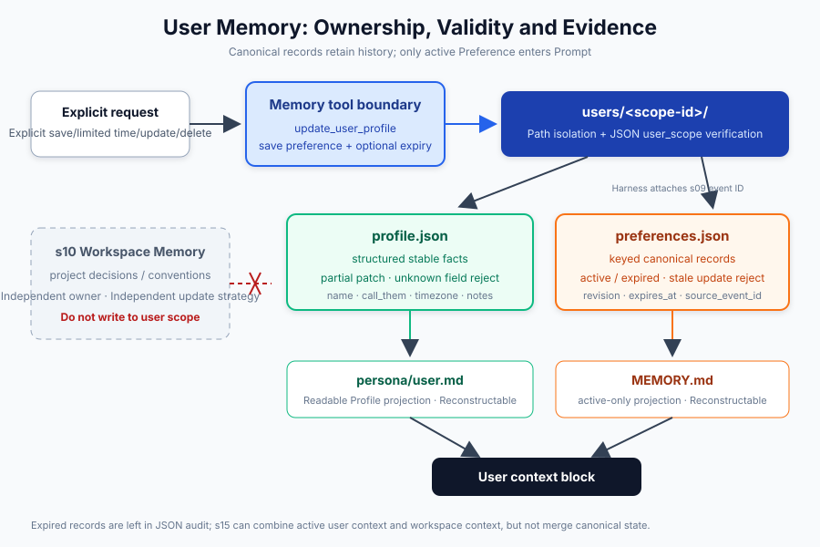
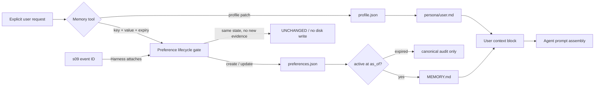

# s11: User Memory - Profile and Preferences Need User Scope

[中文](README.md) · [English](README.en.md)
> *Cross-project preferences belong to the user scope, with explicit updates and soft deletion.*
>
> **Harness layer: user profile projection and preference boundaries.**

User memory separates canonical append-only events from the current profile and preference projections injected into prompts.



## What This Lesson Adds

This lesson adds user-scoped preferences and identity facts while keeping them separate from project-owned memory.

## Learning Goals

Learn how to normalize, deduplicate, scope, and recover user memory without treating every message as a durable preference.

## Code Architecture Diagram



## Storage Model

```text
~/.learn_workbuddy/user-memory/
└── users/
    └── <scope-id>/
        ├── profile.json
        ├── preferences.json
        ├── MEMORY.md
        └── persona/
            ├── core.md
            ├── identity.md
            ├── user.md
            └── bootstrap.md
```

### Canonical State and Projection

## Main Code Paths

### Profile: Explicit Partial Updates

```python
result = memory.update_profile({
    "name": "Alex",
    "call_them": "Alex",
    "timezone": "UTC+8",
})
```

### Preferences: Keyed Deduplication

```python
created = memory.set_preference("response.language", "Chinese")
unchanged = memory.set_preference("response.language", "Chinese")
updated = memory.set_preference("response.language", "English")
```

```text
CREATED   revision=1  previous=None     current=Chinese
UNCHANGED revision=1  previous=Chinese  current=Chinese
UPDATED   revision=2  previous=Chinese  current=English
```

### Temporal Preference Projection

```python
memory.set_preference(
    "response.detail",
    "verbose during onboarding",
    source="transcript",
    source_event_id="session-7:event-42",
    updated_at="2026-08-01T01:00:00Z",
    expires_at="2026-08-02T01:00:00Z",
)
```

### Soft Deletion

```python
memory.delete_preference("response.language")
```

Deletion leaves a tombstone instead of popping the record. Without it, replaying the same evidence (same `source_event_id` and `updated_at`) would bring the forgotten preference back:

```text
CREATED  set_preference(..., updated_at="2026-10-01T00:00:00Z", source_event_id="session-1:e1")
DELETED  delete_preference("response.language")  -> deleted: [{key, deleted_at, revision, source}]
STALE    replay of the same evidence              -> StalePreferenceUpdateError, no resurrection
```

- The tombstone records only which key was deleted, never the deleted content: the old value is absent from `preferences.json`, `MEMORY.md`, and `get_context_for_agent()`. The user's original words in the s09 transcript are out of scope.
- Evidence newer than `deleted_at` recreates the preference with the next revision and clears the tombstone; older or equal evidence raises `StalePreferenceUpdateError`.
- Repeated deletion returns `UNCHANGED` and keeps the first `deleted_at`. An explicit `deleted_at` not later than the live `updated_at` raises and writes nothing.
- Every write path, including `append_memory()`, writes tombstones back. `list_preferences()` and `MEMORY.md` are unchanged; `list_deleted_preferences()` is a read-only audit view.
- The model forgets through `forget_user_preference`, whose schema has only the required `key`; the harness sets `source="model_tool"` and the time.

Expiry keeps the old value as audit evidence; forgetting removes it, so tombstones live in a separate `deleted` array.

#### Forgetting Boundaries

- Forgetting is not a permanent ban: newer evidence can restore the preference. Only timestamps decide, so a replay without `updated_at` (including `append_memory()` replaying the same old text) is written at the current time and recreates it. Replays must keep the original evidence time.
- A real harness should show the key to the user for confirmation before deleting.
- This chapter does not defend against prompt injection: text in `bash` output or workspace files may lure the model into forgetting. The "only when the user explicitly asks" wording is a convention, not a defense.
- Common assistant memory features also let users ask to forget a memory; this chapter borrows only that concept.

### User Scope

```python
alice = UserMemory(root, user_id="alice")
bob = UserMemory(root, user_id="bob")

alice.set_preference("editor.indent", "tabs")
bob.set_preference("editor.indent", "spaces")
```

### Prompt Context

```text
## Assistant values
...

## Assistant identity
...

## User profile
Name: Alex
Timezone: UTC+8

## Explicit user preferences (cross-project)
- `response.language`: Chinese
```

## Why Not Remember Every Sentence

User memory should contain stable preferences and identity facts, not transient conversation details or unverified instructions.

## Boundaries with s10 and s12

User memory follows the person across projects, workspace memory belongs to one project, and remote memory remains a scoped retrieval boundary.

## Append-Only Recovery

```text
validate -> serialize -> write temp file -> fsync -> os.replace
```

## Offline Verification

```bash
python3 -m pytest -q tests/test_user_memory.py tests/test_s11_preference_forget.py
python3 scripts/verify.py
```

## Teaching Demo

```bash
python s11_user_memory/code.py --demo
```

```bash
MODEL_ID=<model> ANTHROPIC_API_KEY=<key> python s11_user_memory/code.py
```

```bash
WORKBUDDY_USER_ID=alice \
WORKBUDDY_HOME=/tmp/learn-workbuddy \
python s11_user_memory/code.py
```

## Exercises

Use these exercises to change one part of user-scoped preferences, projections, and explicit deletion at a time and explain the resulting contract.

## Next Lesson

- User memory separates canonical append-only events from the current profile and preference projections injected into prompts.

**Reference tables**

| Type | Question answered | Update method | Example |
|---|---|---|---|
| Profile | "Who is this user?" | Explicit field patch | `name`, `call_them`, `timezone` |
| Preference | "What is the cross-project default?" | Create, replace, or delete by stable key | `response.language=Chinese` |

| File | Role | Source of truth? |
|---|---|---|
| `profile.json` | Structured user profile | Yes |
| `preferences.json` | Complete keyed preference set with revision, expiry, and source event; includes deletion tombstones, never deleted content | Yes, including expired records |
| `persona/user.md` | Human-readable profile projection | No; rebuildable |
| `MEMORY.md` | Preference projection for inspection and prompt injection | No; rebuildable |
| `persona/core.md` | Assistant values and boundaries | Independent assistant identity |
| `persona/identity.md` | Assistant name, type, and emoji | Independent assistant identity |
| `persona/bootstrap.md` | One-time onboarding instructions | Deleted after completion |

| Layer | Owner | Content | Typical read time |
|---|---|---|---|
| s10 Workspace Memory | Workspace | Project decisions, conventions, pitfalls | When entering the project |
| s11 User Memory | User | Stable profile and explicit cross-project preferences | At session startup |
| s12 Remote Recall | Remote account/service | Long-term history candidates and remote profile | When the query needs it |

The original Chinese README remains the primary-language reference. This English companion keeps the same code, diagrams, local paths, and chapter structure so readers can switch languages without losing runnable details.

Local references:

- [Reference](README.md)
- [Reference](README.en.md)
- [Reference](./images/user-memory-en.svg)
